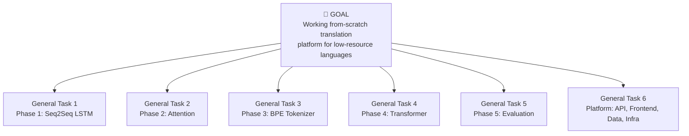
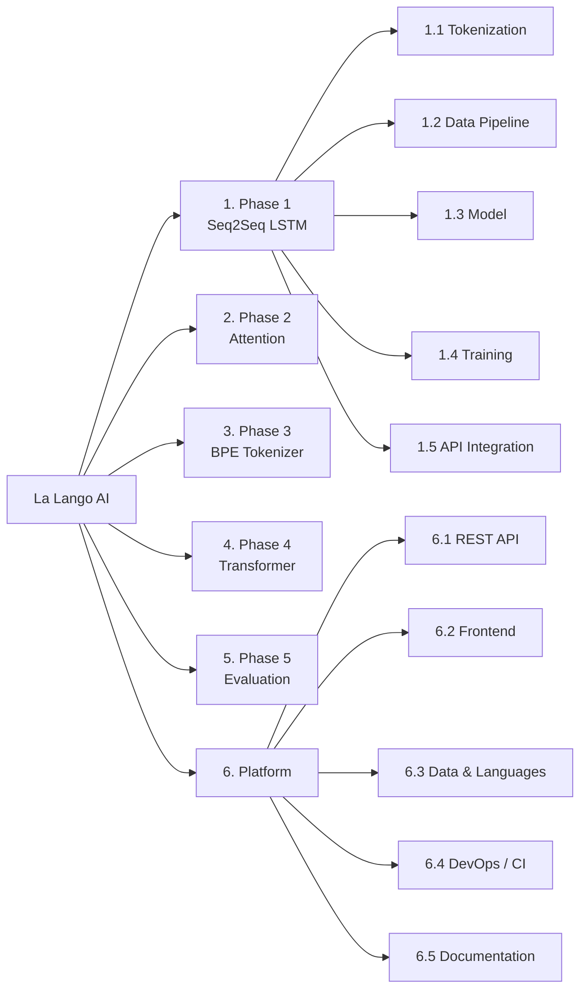
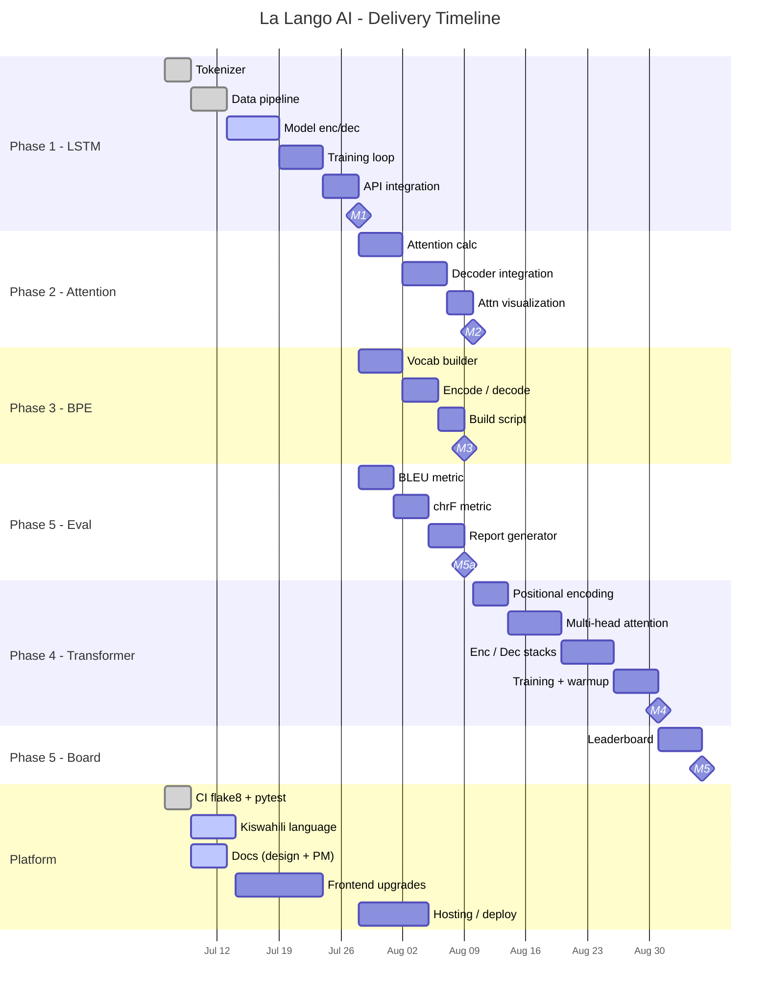
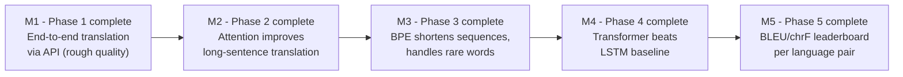
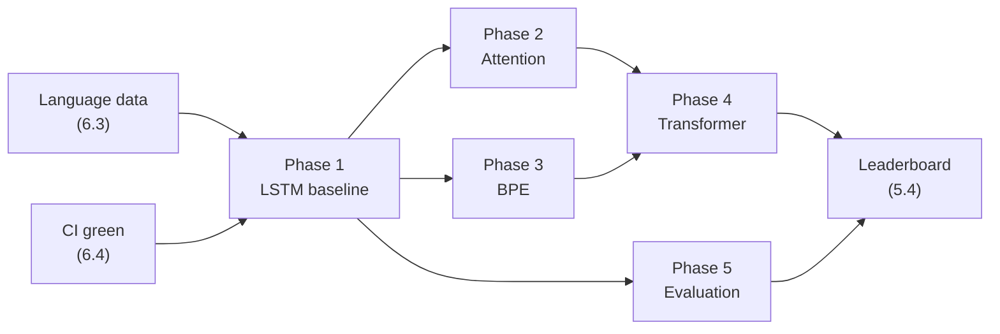

# La Lango AI - Project Management

This document defines **what we are building, who does what, and when**. It
contains the Work Breakdown Structure (WBS), a Gantt chart, and per-phase
milestones with objectives and tasks.

It complements [`ROADMAP.md`](../ROADMAP.md) (the *what*) by adding the
*structure, sequencing, and tracking* layer on top.

> **Diagrams** use [Mermaid](https://mermaid.js.org/) and render on GitHub.
> **Dates** are planning placeholders - adjust the Gantt `section` dates to your
> actual sprint calendar. They are expressed as relative durations so they stay
> valid even if the start date shifts.

---

## 1. Goal Hierarchy

The project is organised into three levels:

- **General Task** - a phase of the project (maps to ROADMAP phases)
- **Specific Objective** - a concrete outcome within a phase
- **Task** - an actionable unit of work under an objective (PR-sized)

---

## 2. Work Breakdown Structure (WBS)

A hierarchical decomposition of all deliverables. IDs (e.g. `1.2.3`) are stable
references you can cite in issues and PRs.

### 2.1 WBS Dictionary (full decomposition)

| WBS ID | Deliverable | Key tasks | Owner (label) |
|--------|-------------|-----------|---------------|
| **1** | **Phase 1 - Seq2Seq LSTM** | | 🟠 model |
| 1.1 | Character tokenizer | encode/decode, special tokens, padding | 🔵 data |
| 1.2 | Data pipeline | `dataset.py` loader, `cleaner.py`, `splitter.py`, batching | 🔵 data |
| 1.3 | Model | `Encoder.forward`, `Decoder.forward_step`, `Seq2SeqLSTM.forward` | 🟠 model |
| 1.4 | Training loop | `train.py`, teacher forcing, checkpointing | 🟠 model |
| 1.5 | API integration | wire `translate()` into `routes.py`, greedy decode | 🟠 model |
| **2** | **Phase 2 - Attention** | | 🟠 model |
| 2.1 | Attention score calc | `attention.py` Bahdanau additive attention | 🟠 model |
| 2.2 | Decoder integration | connect attention into `seq2seq_lstm.py` | 🟠 model |
| 2.3 | Attention visualization | heatmap in experiments notebook | 🔴 research |
| **3** | **Phase 3 - BPE Tokenizer** | | 🔵 data |
| 3.1 | BPE vocab builder | `bpe_tokenizer.py` merge-rule learning | 🔵 data |
| 3.2 | Encode/decode | subword encode + decode round-trip | 🔵 data |
| 3.3 | Vocab build script | CLI to build vocab from corpus | 🔵 data |
| **4** | **Phase 4 - Transformer** | | 🟠 model |
| 4.1 | Positional encoding | `PositionalEncoding` in `transformer.py` | 🟠 model |
| 4.2 | Multi-head attention | `MultiHeadAttention` | 🟠 model |
| 4.3 | Encoder/Decoder stacks | full transformer assembly | 🟠 model |
| 4.4 | Training w/ warmup | LR schedule, integrate into `train.py` | 🟠 model |
| **5** | **Phase 5 - Evaluation** | | 🔴 research |
| 5.1 | BLEU | `bleu.py` n-gram precision + brevity penalty | 🔴 research |
| 5.2 | chrF | `chrf.py` char n-gram F-score | 🔴 research |
| 5.3 | Report generator | `report.py` side-by-side + scores | 🔴 research |
| 5.4 | Leaderboard | per-language-pair scoreboard | 🔴 research |
| **6** | **Platform (cross-cutting)** | | mixed |
| 6.1 | REST API | `/translate`, `/languages`, `/health`, model registry | 🟠 model |
| 6.2 | Frontend | swap button, history, dark mode, animations | 🟢 good-first |
| 6.3 | Data & languages | Kiswahili + additional language registrations | 🔵 data |
| 6.4 | DevOps / CI | flake8+pytest CI ✅, hosting, model artifact storage | 🟢/🟠 |
| 6.5 | Documentation | system design ✅, PM ✅, per-phase guides | 🟢 good-first |

---

## 3. Gantt Chart

The plan runs from **6 July 2026 to early September 2026 (~2 months)**. To keep
the schedule realistic within that window, Phase 1 comes first, then **Phases 2,
3, and 5 run in parallel** (they only need the Phase 1 baseline), Phase 4 follows
Phase 2, and the **Platform track runs alongside throughout**. Adjust the start
anchors (`2026-07-06`, etc.) if your kickoff date shifts.

---

## 4. Milestones

Each milestone is a **verifiable, demoable outcome** - the definition of "done"
for a phase.

| ID | Milestone | Definition of Done | Verification |
|----|-----------|--------------------|--------------|
| **M1** | Phase 1 - Working baseline | `train.py` trains on a corpus; `/translate` returns a real (rough) translation | Manual demo + `test_seq2seq_lstm.py` passing |
| **M2** | Phase 2 - Attention | Attention wired into decoder; measurable BLEU gain on long sentences | Eval comparison M1 vs M2 |
| **M3** | Phase 3 - BPE | BPE encode/decode round-trips; shorter sequences than char-level | Unit tests + sequence-length comparison |
| **M4** | Phase 4 - Transformer | Transformer trains and outperforms LSTM baseline | Leaderboard entry beats M1/M2 |
| **M5** | Phase 5 - Evaluation | Automated BLEU + chrF report and per-pair leaderboard | Report artifact generated in CI or script |

---

## 5. Task Board Mapping (per phase)

Recommended issue labels ↔ WBS mapping so the board stays organised.

| Label | Meaning | Typical WBS areas |
|-------|---------|-------------------|
| 🟢 `good-first-issue` | First-timers, docs, small fixes | 6.2, 6.5 |
| 🔵 `data` | Data cleaning, tokenizers, preprocessing | 1.1, 1.2, 3.x, 6.3 |
| 🟠 `model` | Models and training | 1.3, 1.4, 1.5, 2.x, 4.x, 6.1 |
| 🔴 `research` | Metrics, evaluation, analysis | 2.3, 5.x |

---

## 6. Current Status Snapshot

> Update this table at the end of each sprint.

| Track | Status | Notes |
|-------|--------|-------|
| Phase 1 - LSTM | 🚧 In progress | Model impl in review (PR #5); tokenizer + data pipeline present |
| Phase 2 - Attention | 📋 Planned | Skeleton in `attention.py` |
| Phase 3 - BPE | 📋 Planned | `bpe_tokenizer.py` to be created |
| Phase 4 - Transformer | 📋 Planned | Skeletons in `transformer.py` |
| Phase 5 - Evaluation | 🟡 Partial | `bleu.py`/`chrf.py` exist with tests |
| Platform - CI | ✅ Done | flake8 + pytest passing |
| Platform - Kiswahili | 🚧 In progress | Language registration (PR #2) |
| Platform - Docs | 🚧 In progress | This document + system design added |
| Platform - Hosting | 📋 Planned | Not yet set up |

---

## 7. Dependencies & Critical Path

**Critical path:** `Data + CI → Phase 1 (M1) → Phase 2 (M2) + Phase 3 (M3) →
Phase 4 (M4) → Leaderboard (M5)`.

Phase 1 is the bottleneck - everything depends on a working baseline, so it gets
priority.

---

## 8. Related Documents

- [`ROADMAP.md`](../ROADMAP.md) - phase descriptions and "done" criteria
- [`system_design.md`](system_design.md) - architecture, data flow, flowcharts
- [`CONTRIBUTING.md`](../CONTRIBUTING.md) - how to pick up and submit tasks
