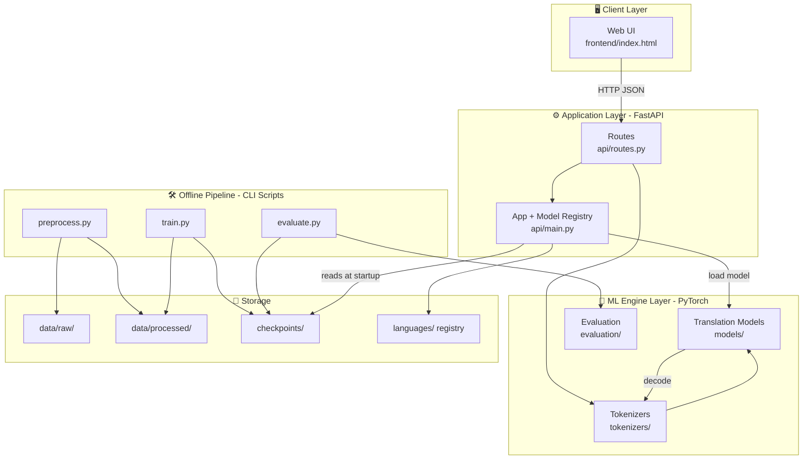
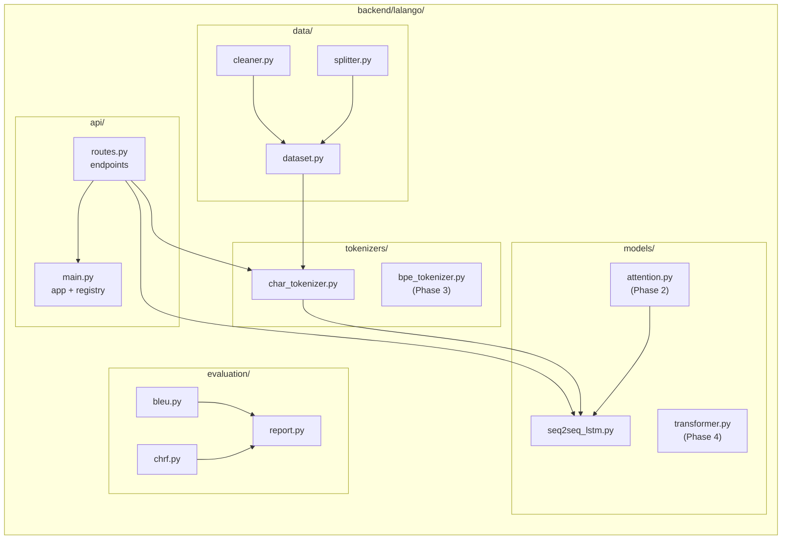
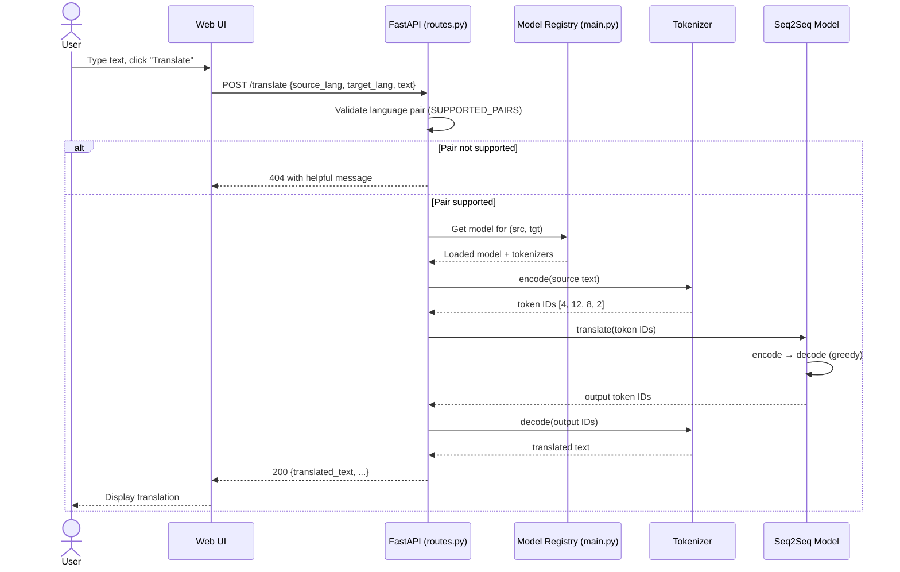
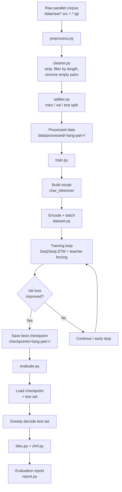
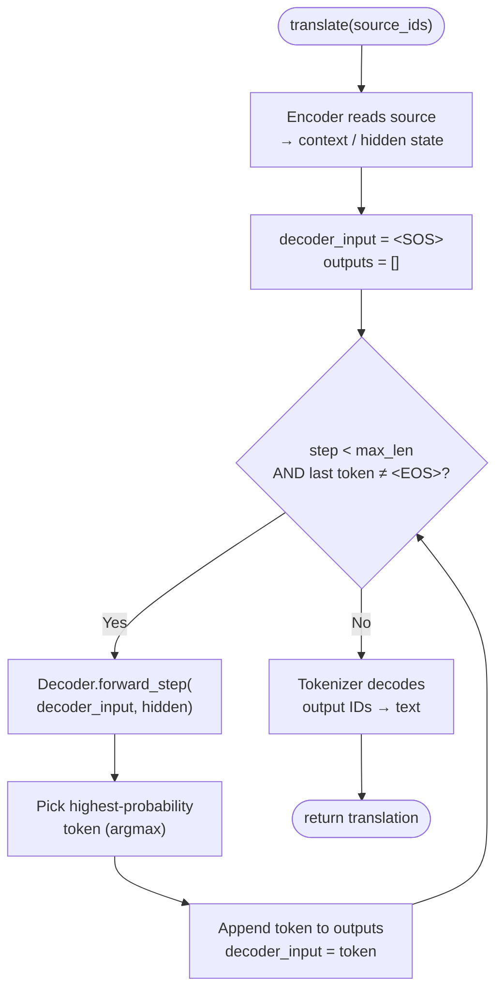
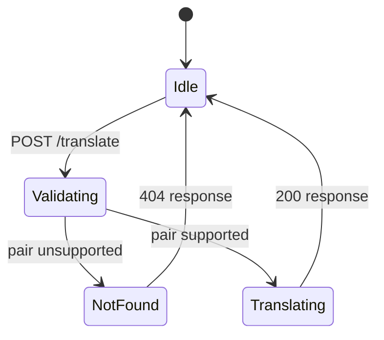
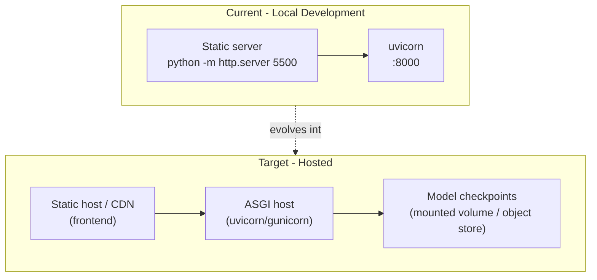

# La Lango AI - System Design

This document is the single source of truth for **how La Lango AI is built** -
the architecture, the components, how data flows through the system, and the
step-by-step logic of the core workflows (training, inference, and API requests).

All diagrams use [Mermaid](https://mermaid.js.org/), which renders automatically
on GitHub. If you are reading this in an editor without Mermaid support, view it
on GitHub or install a Mermaid preview extension.

> For a plain-English explanation of the *models* themselves (LSTM, attention,
> transformer), see [`architecture.md`](architecture.md). This document focuses
> on the *system* as a whole.

---

## 1. System Overview

La Lango AI is a **low-resource machine translation platform** with three layers:

| Layer | Technology | Responsibility |
|-------|-----------|----------------|
| **Presentation** | Plain HTML/CSS/JS (`frontend/index.html`) | User interface for entering and viewing translations |
| **Application / API** | FastAPI (`backend/lalango/api/`) | REST endpoints, request validation, model orchestration |
| **ML Engine** | PyTorch (`backend/lalango/`) | Tokenization, translation models, training, evaluation |

The guiding principle: **everything is implemented from scratch - no external
AI APIs, no black boxes.**

---

## 2. Component Architecture

The backend core package `backend/lalango/` is organised into focused modules.
This mirrors the actual folder structure on disk.

### Module responsibilities

| Module | File(s) | Responsibility |
|--------|---------|----------------|
| **API** | `api/main.py`, `api/routes.py` | HTTP endpoints, request/response schemas, model registry |
| **Tokenizers** | `tokenizers/char_tokenizer.py` | Convert text ↔ integer token IDs (char-level now, BPE later) |
| **Data** | `data/dataset.py`, `cleaner.py`, `splitter.py` | Load corpora, clean pairs, split train/val/test, batch |
| **Models** | `models/seq2seq_lstm.py`, `attention.py`, `transformer.py` | The neural translation architectures |
| **Evaluation** | `evaluation/bleu.py`, `chrf.py`, `report.py` | Quality metrics and reporting |
| **Scripts** | `scripts/preprocess.py`, `train.py`, `evaluate.py` | Offline CLI pipelines |

---

## 3. Data Flow - Translation Request (Runtime)

This is what happens when a user translates a sentence in the browser.

---

## 4. Data Flow - Offline Training Pipeline

This is the flow a contributor runs to produce a trained model, before it is
ever served by the API.

---

## 5. Flowchart - Model Inference (Greedy Decoding)

The core logic inside `Seq2SeqLSTM.translate()`.

---

## 6. API Contract

Defined in `backend/lalango/api/routes.py`.

| Method | Endpoint | Request | Response |
|--------|----------|---------|----------|
| `POST` | `/translate` | `{ source_lang, target_lang, text }` | `{ translated_text, source_lang, target_lang, model }` |
| `GET` | `/languages` | - | `{ supported_pairs: [...] }` |
| `GET` | `/health` | - | `{ status: "ok" }` |

**Error handling:** unsupported language pairs return `404` with a message
listing supported pairs and pointing to the `languages/` registry.

---

## 7. Deployment View (Current & Target)

> **Note:** hosting is not yet set up - this is the intended target. See the
> project management doc for where this sits on the timeline.

---

## 8. Key Design Decisions

| Decision | Rationale |
|----------|-----------|
| **From-scratch models (no external AI APIs)** | Core mission: educational + full control for low-resource languages |
| **Character-level tokenizer first** | Simplest entry point; works for any script without pre-built vocab |
| **Phased model roadmap (LSTM → Attention → BPE → Transformer)** | Each phase builds intuition for the next; keeps contributions accessible |
| **Single-file frontend (no framework)** | Zero build step; approachable for first-time contributors |
| **Language registry in `languages/`** | Community can add languages via config + corpus without touching core code |
| **FastAPI** | Automatic OpenAPI docs, async-ready, Pydantic validation |

---

## 9. Related Documents

- [`architecture.md`](architecture.md) - how the ML models work (conceptual)
- [`data_format.md`](data_format.md) - corpus and processed data formats
- [`adding_a_language.md`](adding_a_language.md) - contributor guide for new languages
- [`evaluation_guide.md`](evaluation_guide.md) - how metrics are computed
- [`project_management.md`](project_management.md) - WBS, Gantt chart, milestones
